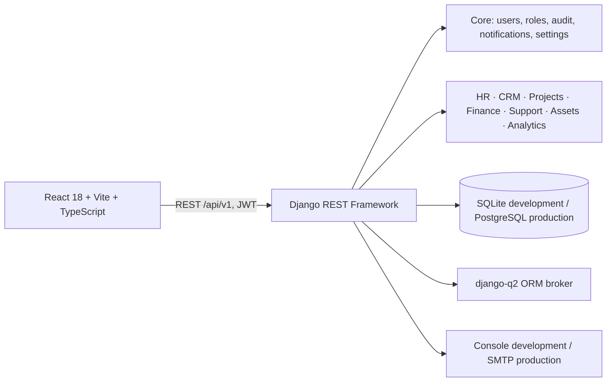

# DevERP

DevERP is an open-source ERP for software and IT services teams. This repository is being built in the approved eight phases. Phase 1 provides the platform foundation: authentication, role-based access, audit logging, notifications, company settings, API documentation, and the responsive React shell. Phase 2 adds departments, employee profiles and documents, reporting structure, attendance, leave balances and approvals, monthly leave accrual, and the holiday calendar. Phase 3 adds client-linked projects, milestones, task delivery, sprints, approved billable time, and team resourcing.

## Run with Docker

1. Copy `.env.example` to `.env` and set a unique `DJANGO_SECRET_KEY` and PostgreSQL password.
2. Run `docker compose up --build`.
3. Open the application at <http://localhost:8080>; the API schema is at <http://localhost:8080/api/docs/>.
4. Create an administrator in another terminal:

   ```powershell
   docker compose exec -it backend python manage.py createsuperuser
   ```

The first run applies database migrations automatically. To stop, press Ctrl+C; use `docker compose down` to stop services. Persistent database and upload data are stored in named Docker volumes.

## Run locally without Docker

Requires Python 3.12+ and Node.js 20+. The root `.env` is loaded for local Django development; SQLite is used when both `DATABASE_URL` and `POSTGRES_HOST` are blank.

```powershell
Copy-Item .env.example .env
cd backend
py -3.12 -m venv .venv
.\.venv\Scripts\Activate.ps1
python -m pip install -r requirements\development.txt
python manage.py migrate
python manage.py createsuperuser
python manage.py runserver
```

In a second terminal:

```powershell
cd frontend
npm install
npm run dev
```

The development UI is at <http://localhost:5173>, and Vite proxies API requests to Django on port 8000.

## Configuration

All runtime configuration is via environment variables; see [`.env.example`](.env.example). Docker supplies PostgreSQL through `POSTGRES_DB`, `POSTGRES_USER`, `POSTGRES_PASSWORD`, `POSTGRES_HOST`, and `POSTGRES_PORT`; a non-empty `DATABASE_URL` takes precedence for deployments that provide one. The sample secret and database password are for local development only: replace both with unique values before deploying, and never commit `.env`. For local Docker over HTTP the sample disables HTTPS redirects and secure-only cookies; set `DJANGO_SECURE_SSL_REDIRECT=true` and `DJANGO_SECURE_COOKIES=true` behind HTTPS in production. Debug mode defaults off, the email backend is the console in development and SMTP when configured in production, and currency/time zone are configurable.

## Architecture



## API

The API is versioned under `/api/v1/`. OpenAPI docs are served at `/api/docs/`; the schema is at `/api/schema/`. See [docs/API.md](docs/API.md) for the endpoint reference.

| Area | Routes |
|---|---|
| Auth | `POST /auth/login`, `/auth/logout`, `/auth/token/refresh`, `/auth/password/reset`, `/auth/password/reset/confirm`, `/auth/2fa/setup`, `/auth/2fa/confirm`, `/auth/2fa/disable` |
| Users and roles | `/users`, `/users/me`, `/roles`, `/users/{id}/roles`, `POST /users/import`, `GET /users/export?file_format=csv|xlsx` |
| Audit | `GET /audit-logs` |
| Notifications | `/notifications`, `/notifications/unread-count`, `/notifications/{id}/read`, `/notifications/read-all` |
| Company settings | `/company-settings` |
| Saved filters and feed | `/saved-filters`, `/activity-feed` |
| Search | `GET /search?q=...` |
| HR | `/hr/departments`, `/hr/designations`, `/hr/employees`, `/hr/emergency-contacts`, `/hr/employee-documents`, `/hr/attendance`, `/hr/leave-types`, `/hr/leave-balances`, `/hr/leave-requests`, `/hr/holidays` |
| Projects and delivery | `/clients`, `/projects`, `/milestones`, `/tasks`, `/sprints`, `/time-entries`, `/resource-allocations` |
| CRM and sales | `/crm/leads`, `/crm/contacts`, `/crm/deals`, `/crm/activities` |

| Frontend area | Route |
|---|---|
| Dashboard | `/` |
| CRM, HR, delivery | `/crm`, `/hr`, `/delivery` |
| Notifications and activity | `/notifications`, `/activity` |
| Account security | `/security` |
| Administration | `/settings`, `/access`, `/audit-log` |

The employee/org chart, attendance, leave, and holiday API details are documented in [docs/API.md](docs/API.md). Monthly leave accrual is idempotently run with `python manage.py accrue_leave_balances --year YYYY --month MM` from the backend directory; schedule this command monthly in the deployment environment.

All list endpoints use pagination. Administrative operations require the Admin role; HR management writes require HR or Admin, and employee data is scoped to the employee, direct manager, or HR/Admin.

## Quality checks

Backend: `cd backend; python -m ruff check .; python -m ruff format --check .; python -m mypy apps config; python -m pytest --cov=apps --cov-fail-under=80`. Frontend: `cd frontend; npm run lint; npx tsc -b; npm test; npm run build`. CI runs backend lint/type checks/tests and frontend lint/type checks/tests/build on pushes and pull requests.

## License

MIT. See `LICENSE`.
